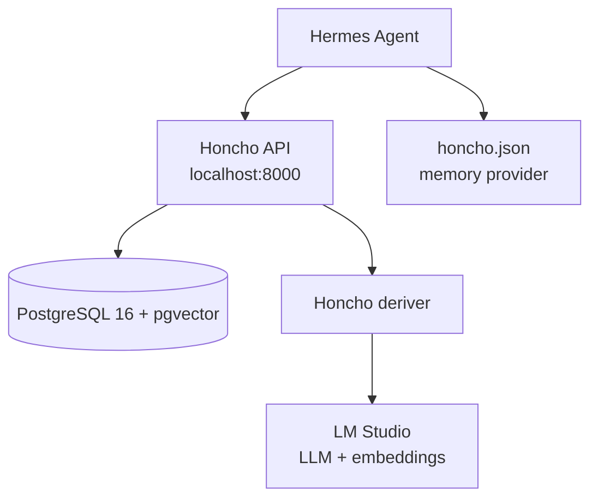

```mermaid
flowchart TB
    Hermes["Hermes Agent"] --> API["Honcho API\nlocalhost:8000"]
    API --> PG[("PostgreSQL 16 + pgvector")]
    API --> Deriver["Honcho deriver"]
    Deriver --> LM["LM Studio\nLLM + embeddings"]
    Hermes --> Config["honcho.json\nmemory provider"]
```     

[ссылка](docs\bee.md)

### Заголовок 3 уровня